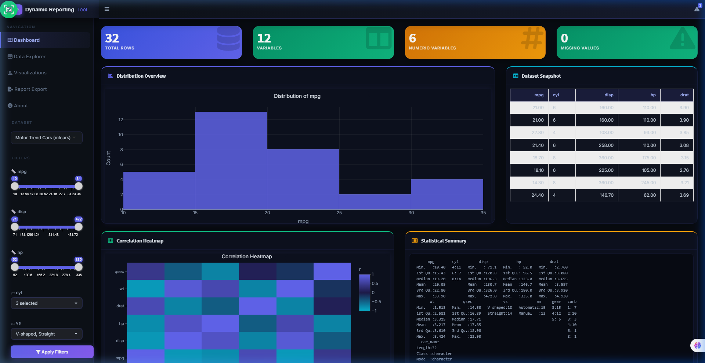
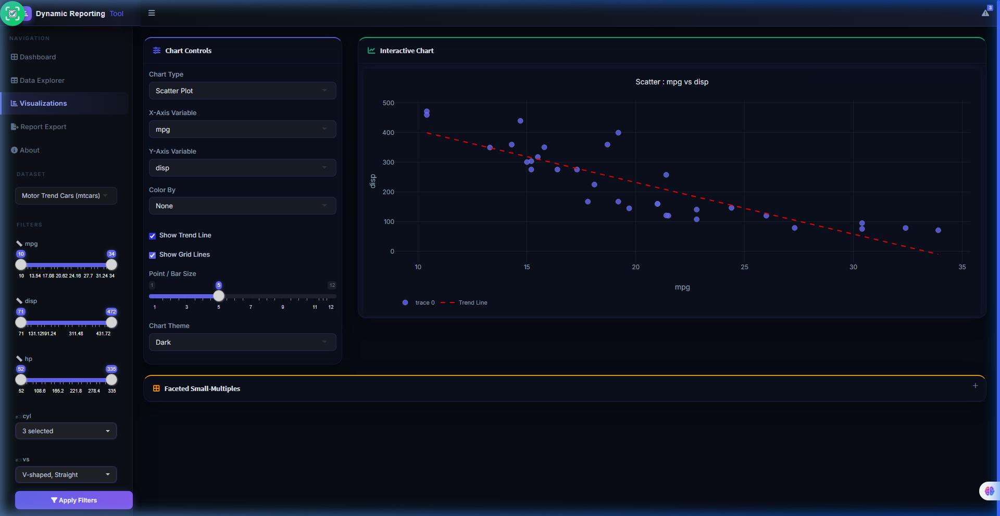
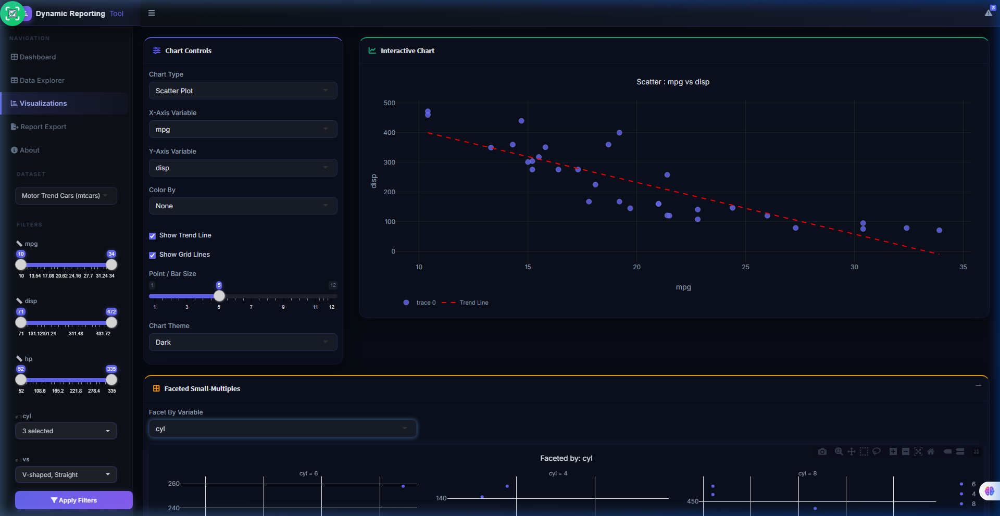
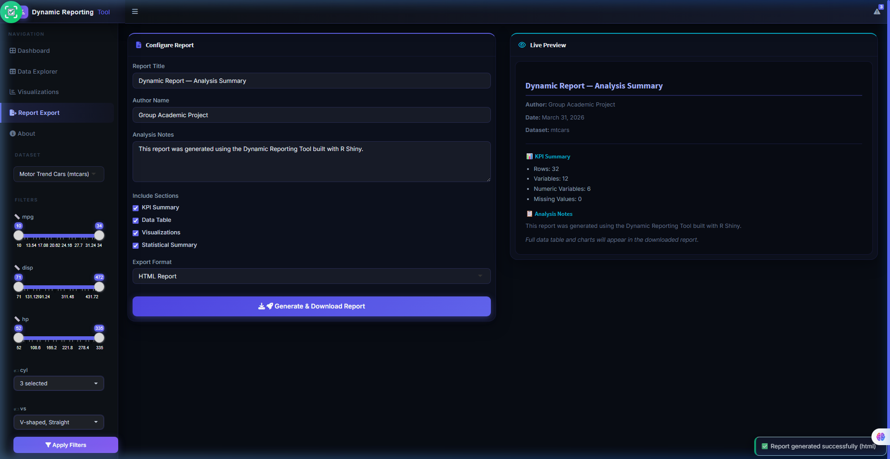
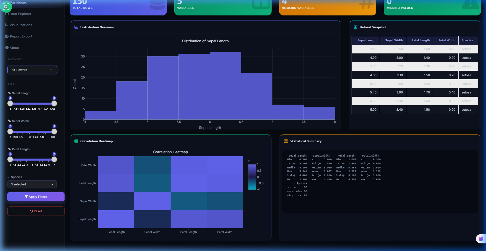
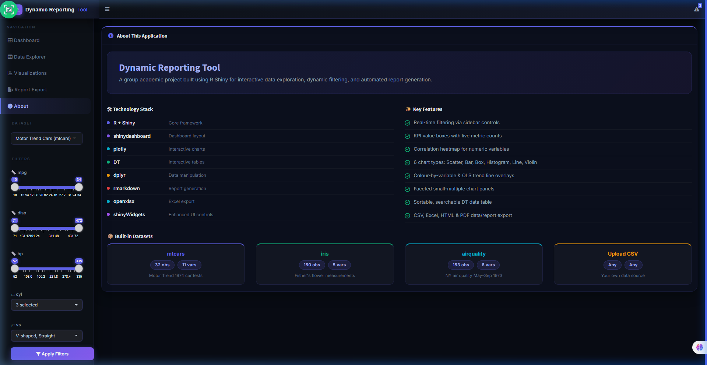

<div align="center">

<!-- ██ LIVE APP LINK — click to open ██ -->
<a href="https://abhishekkothe.shinyapps.io/dynamic-reporting-tool/" target="_blank">
  
</a>

<br/><br/>


<!-- Typing animation -->


<br/><br/>

[](https://abhishekkothe.shinyapps.io/dynamic-reporting-tool/)
[](https://github.com/Abhishek7439/dynamic-reporting-tool)

<br/>


</div>

---

## Overview

**Dynamic Reporting Tool** is a production-ready, interactive data analytics dashboard built entirely with **R Shiny**. It enables users to explore datasets through real-time filters, generate insightful visualizations across 6 chart types, and export fully customized reports — all within a premium deep-space dark themed UI.

> Developed as a **group academic project** for live demonstration and evaluation. Built with a focus on clean architecture, robust error handling, and an impressive user experience.

---

## Screenshots

| Dashboard | Scatter Plot with Trend Line |
|:---------:|:----------------------------:|
|  |  |

| Faceted Small-Multiples | Report Export |
|:-----------------------:|:-------------:|
|  |  |

| Iris Dataset Loaded | About Page |
|:-------------------:|:----------:|
|  |  |

---

## Features

### Dashboard
- **4 Live KPI Boxes** — Total Rows, Variables, Numeric Variables, Missing Values (update on every filter)
- **Distribution Histogram** — Auto-renders for the primary numeric variable
- **Correlation Heatmap** — Cyan-to-indigo plotly heatmap for all numeric columns
- **Statistical Summary** — Full `R summary()` output in a dark-styled panel
- **Dataset Snapshot** — Top 8 rows of the active dataset

### Real-Time Filtering
- **Numeric range sliders** — Auto-generated per dataset (up to 3 variables)
- **Multi-select pickers** — For categorical columns with live search
- **Apply / Reset** — One-click filter application and reset with notification

### Interactive Visualizations (6 Chart Types)

| Chart Type | Description |
|------------|-------------|
| **Scatter Plot** | X vs Y with optional OLS trend line |
| **Bar Chart** | Aggregated mean per category |
| **Box Plot** | IQR, whiskers, and outliers |
| **Histogram** | Frequency distribution |
| **Line Chart** | Ordered connected data points |
| **Violin Plot** | Density + box + mean marker |

- **Color-by-variable** grouping across 8-color neon palette
- **Faceted small-multiples** — up to 12 panels per categorical variable
- **Dark chart theme** — transparent canvas + Inter typography

### Data Explorer
- Searchable, sortable, paginated **DT table**
- **Column selector** — choose which columns to display
- **Sort direction toggle** — ascending / descending
- **Export:** CSV, Excel (.xlsx), PDF, Print, Copy

### Automated Report Generation
- **Live preview** panel before download
- **HTML & PDF** output formats
- **Configurable sections** — KPI Summary, Data Table, Visualizations, Statistical Analysis
- **Custom title, author name, analysis notes**
- **Pandoc auto-detection** — falls back to a self-contained R-only HTML report

### Premium UI/UX
- Deep-space dark theme `#080c14` with **glassmorphism cards**
- Neon accent palette — indigo `#6366f1`, cyan `#06b6d4`, emerald `#10b981`
- **Inter** typeface via Google Fonts
- Smooth **fadeUp tab transitions**, hover lift effects on KPI cards
- Custom scrollbar, dark notification toasts, dark disconnected overlay
- Dropdown **z-index fix** — no clipping behind sibling cards

---

## Tech Stack

| Package | Role |
|---------|------|
| `shiny` | Core reactive web framework |
| `shinydashboard` | Dashboard layout — sidebar, boxes, value boxes |
| `shinyWidgets` | Enhanced widgets (`pickerInput`, `sliderInput`) |
| `plotly` | Interactive, animated charts |
| `dplyr` | Fast, expressive data manipulation |
| `DT` | Interactive JavaScript data tables |
| `ggplot2` | Base plotting support |
| `scales` | Number formatting helpers |
| `openxlsx` | Excel (.xlsx) export |
| `rmarkdown` + `knitr` | Report rendering |
| `htmltools` | Safe HTML construction for fallback reports |

---

## Project Structure

```
Dynamic Reporting Tool/
├── app.R                  # Entry point — sources ui.R + server.R
├── ui.R                   # Full dashboard UI + 500+ line premium CSS
├── server.R               # All reactive logic, filtering, charts, export
├── global.R               # Package auto-install + global helpers
├── report_template.Rmd    # Parameterised Rmd template (rmarkdown path)
├── deploy_shinyapps.R     # One-click shinyapps.io deploy script
├── www/
│   └── report.css         # Styles for generated HTML reports
└── screenshots/           # README screenshot assets
```

---

## Installation & Setup

### Prerequisites
- **R >= 4.0** — [Download from CRAN](https://cran.r-project.org/)
- **RStudio** (recommended) — [Download](https://posit.co/download/rstudio-desktop/)

### Run Locally

```r
# 1. Clone the repository
# git clone https://github.com/Abhishek7439/dynamic-reporting-tool.git
# cd dynamic-reporting-tool

# 2. Open in RStudio or run directly
# All packages install automatically on first launch via global.R

# 3. Start the app
shiny::runApp(".", launch.browser = TRUE, port = 3838)
```

Or from terminal / PowerShell:

```powershell
Rscript -e "shiny::runApp('.', launch.browser=TRUE)"
```

### Optional: Enable PDF Reports

```r
tinytex::install_tinytex()   # One-time setup for LaTeX / PDF export
```

---

## Usage Instructions

1. **Select a dataset** from the sidebar dropdown (mtcars, iris, airquality, or upload CSV)
2. **Apply filters** using the auto-generated sliders and multi-select pickers, then click **Apply Filters**
3. Navigate to **Data Explorer** to browse, search, sort, and export the filtered table
4. Go to **Visualizations** — choose chart type, X/Y variables, color grouping, and chart theme
5. Toggle **Show Trend Line** on scatter plots or expand **Faceted Small-Multiples**
6. Visit **Report Export** — configure title, author, notes, sections, format then click **Generate & Download Report**

---

## Live Demo

> The app is publicly deployed on **shinyapps.io** (free tier)

**[Launch Live Demo](https://abhishekkothe.shinyapps.io/dynamic-reporting-tool/)**

```
https://abhishekkothe.shinyapps.io/dynamic-reporting-tool/
```

---

## Built-in Datasets

| Dataset | Rows | Variables | Description |
|---------|------|-----------|-------------|
| `mtcars` | 32 | 11 | Motor Trend 1974 car road tests |
| `iris` | 150 | 5 | Fisher's iris flower measurements |
| `airquality` | 153 | 6 | NY air quality May-Sep 1973 |
| Upload CSV | Any | Any | Your own custom dataset |

---

## Future Enhancements

- [ ] **User Authentication** — `shinymanager` integration for secure login
- [ ] **ML Clustering** — K-means or DBSCAN segmentation layer
- [ ] **Predictive Analytics** — Linear/logistic regression overlay on charts
- [ ] **Real-Time Data** — API-connected live feeds (stock prices, weather)
- [ ] **Multi-Dataset Join** — Merge two uploaded CSVs on a common key
- [ ] **Dashboard Themes** — Light mode toggle alongside dark glassmorphism
- [ ] **Scheduled Reports** — Email-triggered automated PDF delivery

---

## Contributors

| Name | Role |
|------|------|
| **Abhishek** | Lead Developer — UI, Server Logic, Deployment |
| **Group Members** | Academic Project Collaborators |

> **Group Academic Project** — Dynamic Reporting Tool
> Built for live academic evaluation demonstrating R Shiny capabilities.

---

## License

This project is licensed under the **[MIT License](LICENSE)** — free to use, modify, and distribute.

---

## Acknowledgements

- [Posit / RStudio](https://posit.co/) — for the incredible R Shiny ecosystem
- [Plotly R](https://plotly.com/r/) — for beautiful interactive charts
- [capsule-render](https://github.com/kyechan99/capsule-render) — animated banner
- [readme-typing-svg](https://github.com/DenverCoder1/readme-typing-svg) — typing animation
- [shields.io](https://shields.io/) — badge generation

---

<div align="center">


**Live App:** [abhishekkothe.shinyapps.io/dynamic-reporting-tool](https://abhishekkothe.shinyapps.io/dynamic-reporting-tool/)
&nbsp;&bull;&nbsp;
**GitHub:** [Abhishek7439/dynamic-reporting-tool](https://github.com/Abhishek7439/dynamic-reporting-tool)

Made with :heart: using **R + Shiny** &nbsp;|&nbsp; Group Academic Project 2026

</div>
